# Akame-Lucy

Software developer working across game scripting, web technologies, and cybersecurity.

---

## About

Multi-language developer focused on Lua-based game modding, JavaScript/PHP web development, Linux systems administration, and cybersecurity. Runs a CTF platform for hands-on security practice.

## Tech Stack

## Currently Working On

- Linux systems administration
- Expanding JavaScript and Python skills
- Strengthening Java fundamentals
- Server-side development
- Building and hosting a CTF platform
- Practicing cybersecurity — penetration testing and vulnerability research

## Projects

**[MyCyberPlayground](https://MyCyberPlayground.xyz)** - CTF challenges and a leaderboard for practicing security skills.

**[AL-Scripts](https://alscripts.xyz)** - Developing FiveM scripts.

## GitHub Stats

## Contact

